## 📚 Attachments Architecture — *A Contributor-Focused Blog Post*

> **Why this page?**
> The Attachments library’s public API is intentionally tiny (`Attachment(...)`).
> Under the hood, however, it’s a **pluggable media-pipeline** that you can extend with just a few lines of code.
> This post walks you through the moving parts so you can jump in, add a loader, fix a renderer, or invent a new `[transform]` without breaking the rest of the ecosystem.

---

### 1. What Attachments Does (30 sec recap)

1. **Load** – turn a *path / URL / string* into a Python object.
2. **Transform** – (optional) apply DSL commands in square-brackets, e.g. `rotate:90`.
3. **Render** – export that object to **text**, **image(s)** or **audio** so an LLM can consume it.
4. **Deliver** – expose `.text`, `.images`, `.audio`, plus helpers like `to_openai_content()`.

```mermaid
flowchart LR
    A["input<br/>('file.pdf[1-3]')"] --> B(Loader)
    B --> C(Transform⏩0‒N)
    C --> D(Renderer-Text)
    C --> E(Renderer-Image)
    C --> F(Renderer-Audio)
    D & E & F -.-> G["Attachment<br/>.text / .images / .audio"]
```



---

### 2. Six Core Concepts

| Concept        | Where to look               | One-liner                                                  |
| -------------- | --------------------------- | ---------------------------------------------------------- |
| **Registry**   | `attachments/registry.py`   | Priority-ordered map of *kind* → list\[(priority, plugin)] |
| **Loader**     | `attachments/core.py` (ABC) | `path → obj`                                               |
| **Renderer**   | `attachments/core.py` (ABC) | `obj → text ∣ [img b64] ∣ [audio b64]`                     |
| **Transform**  | `attachments/core.py` (ABC) | `obj, arg → obj`  - triggered by `[token:arg]`             |
| **Discovery**  | `attachments/discovery.py`  | Imports external plugins from `$ATTACHMENTS_PLUGIN_PATH`   |
| **Attachment** | `attachments/core.py`       | Orchestrates the pipeline • user-facing API                |

---

### 3. Directory Layout (built-ins)

```
attachments/
├─ __init__.py           # loads external plugins, then internal ones
├─ registry.py           # global REGISTRY singleton
├─ discovery.py          # env-var scanning helper
├─ core.py               # ABCs + Attachment class
└─ plugins/
    ├─ loaders/…         # PDFLoader, ImageLoader, …
    ├─ renderers/…       # PDFTextRenderer, ImageB64Renderer, …
    └─ transforms/…      # rotate, summary, …
```

You **never modify** `core.py` or `registry.py` for new functionality; instead drop a file into one of the `plugins/` sub-folders **or** any directory on `$ATTACHMENTS_PLUGIN_PATH`.

---

### 4. How the Registry Picks a Plugin

```python
from attachments.registry import REGISTRY
loader_cls = REGISTRY.first(
    "loader",
    lambda L: L().match("/path/data.csv")
)
```

* Highest priority wins.
* You can reorder at runtime:

```python
from attachments.plugins.renderers.csv_full_text_renderer import CSVFull
REGISTRY.bump_priority(CSVFull, +50)
```

---

### 5. Minimal “Hello, Plugin!” Example

```python
# ~/my_attachments_plugins/md_loader.py  (external)
from attachments.registry import REGISTRY
from attachments.core import Loader, Renderer

class MDLoader(Loader):
    def match(self, path): return path.endswith(".md")
    def load(self, path):  return open(path, encoding="utf-8").read()

REGISTRY.register("loader", MDLoader, priority=120)

class MDText(Renderer):
    content_type = "text"
    def match(self, obj): return isinstance(obj, str) and obj.lstrip().startswith("#")
    def render(self, obj, meta): return obj  # just return markdown as-is

REGISTRY.register("renderer_text", MDText, priority=120)
```

Enable it:

```bash
export ATTACHMENTS_PLUGIN_PATH="$HOME/my_attachments_plugins"
python - <<'PY'
from attachments import Attachment
print(Attachment("README.md")[:200])
PY
```

---

### 6. Writing a Transform

```python
# plugins/transforms/uppercase_transform.py
from attachments.registry import REGISTRY
from attachments.core import Transform

class Upper(Transform):
    name = "upper"
    def apply(self, obj, arg):
        if isinstance(obj, str):
            return obj.upper()
        return obj

REGISTRY.register("transform", Upper, 100)
```

Use it:

```python
Attachment("notes.txt[upper]").text
```

---

### 7. Contributor Checklist ✅

1. **Fork & clone** → `git clone …attachments`

2. `python -m venv venv && source venv/bin/activate && pip install -e .[dev]`

3. Add your plugin file in `plugins/…` **or** set `$ATTACHMENTS_PLUGIN_PATH`.

4. Run the smoke test:
   TODO determine what is the right test to run.

5. Add a minimal unit-test under `tests/`.

6. Open a PR & describe: *What it loads/renders, any new deps, default priority*.

---

### 8. Roadmap & “wishlist” ideas

* **Website-specific loaders** – e.g. YouTube transcript, GitHub repo tree.
* **Advanced PDF transforms** – split by heading, extract tables only.
* **Smart summarising renderers** (long → brief) with tunable token budgets.
* **Audio loaders** – WAV/MP3 → whisper-JSON → text + spectrogram image.

---

### 9. TL;DR

*One class to use (`Attachment`), one registry to hack (`REGISTRY`).*
Everything else is just a Python file away. Happy extending!
